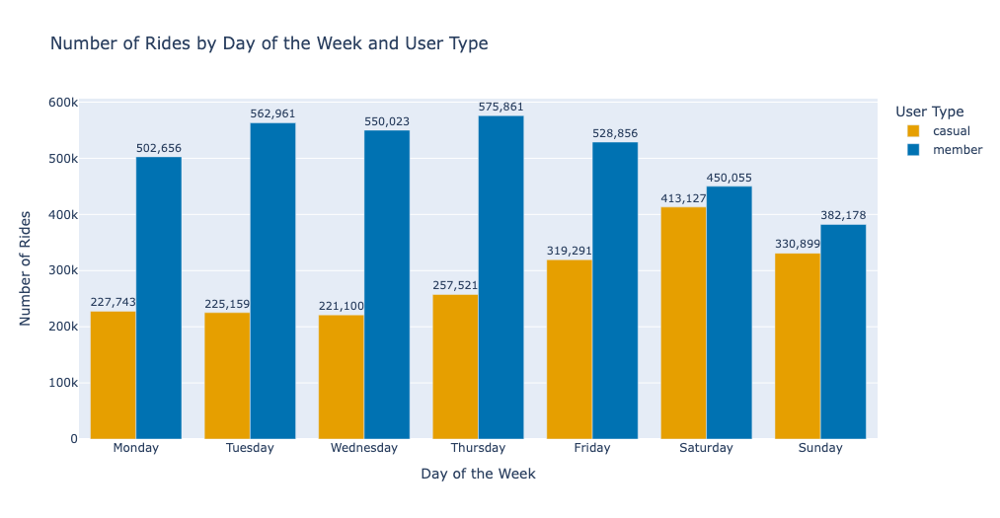
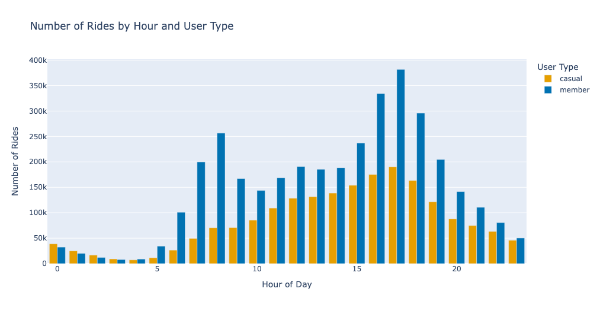
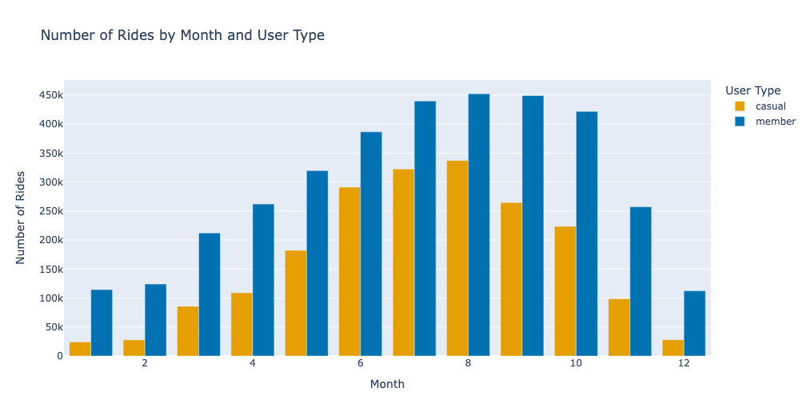
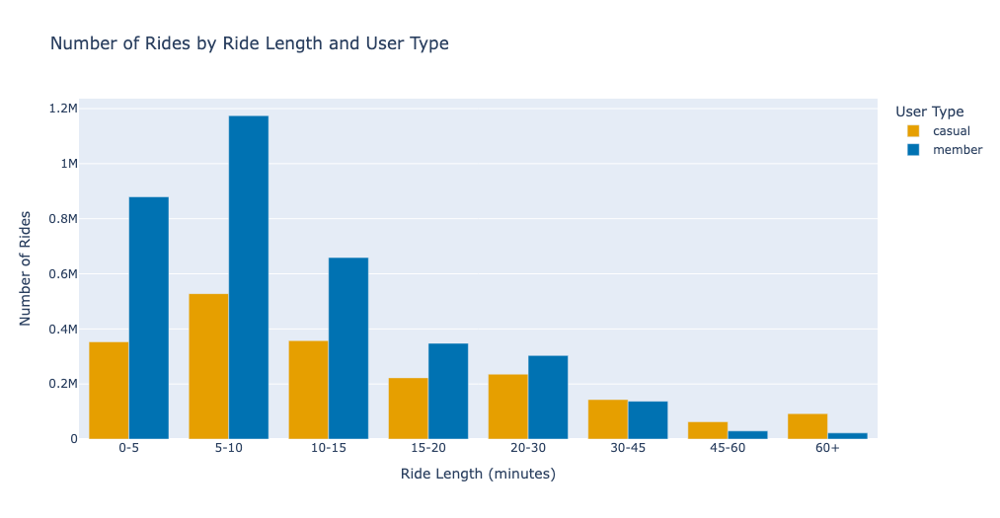
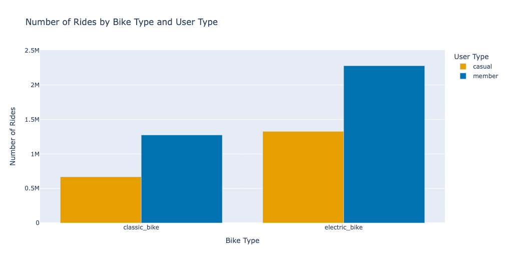

# 🚲 Cyclistic Bike-Share User Behavior Analysis

**Python | Pandas | NumPy | Matplotlib | Seaborn | Jupyter Notebook**

## 📊 Project Overview

This project analyzes historical Cyclistic bike-share trip data to understand how **annual members** and **casual riders** use the bike-sharing service differently.

The analysis focuses on identifying differences in riding frequency, timing, duration, bike preferences, and station usage.

## 🎯 Business Question

**How do casual riders and annual members use Cyclistic bikes differently, and what behavioral patterns could help identify opportunities for membership growth?**

## 🛠️ Tools & Technologies

* Python
* Pandas
* NumPy
* Matplotlib
* Seaborn
* Jupyter Notebook
* Kaggle

## 🔍 Analysis Approach

The project follows a typical data analysis workflow:

**Data Preparation → Data Cleaning → Exploratory Data Analysis → Behavioral Insights → Business Recommendations**

The analysis covers:

* Ride volume by user type
* Weekly riding patterns
* Hourly riding patterns
* Monthly and seasonal trends
* Ride duration
* Bike type preferences
* Station usage
* Geographic riding patterns

## 📈 Key Findings

### Annual Members

* Ride activity is more concentrated around weekday morning and evening peak periods.
* Members show relatively consistent riding patterns across regular time periods.
* Shorter rides represent a larger share of member usage.

### Casual Riders

* Ride activity is more distributed across the afternoon and evening.
* Weekend riding activity is stronger compared with annual members.
* Casual riders have a higher share of longer-duration trips.

### Overall Insight

The analysis identifies clear behavioral differences between annual members and casual riders in terms of **when, how long, and where they use the bike-share service**.

These differences provide a basis for customer segmentation and targeted membership strategies.

## 📊 Key Visualizations

### Weekly Riding Patterns



### Hourly Riding Patterns



### Monthly & Seasonal Trends



### Ride Duration



### Bike Type Preferences



## 💡 Business Recommendations

Based on the observed riding patterns, Cyclistic could consider:

1. **Targeted Membership Campaigns**
   Identify frequent casual riders as potential audiences for membership campaigns.

2. **Seasonal and Weekend Engagement**
   Consider campaign timing around periods when casual riding activity is higher.

3. **Location-Based Targeting**
   Analyze stations with high casual rider activity to identify potential marketing opportunities.

4. **Demand Planning**
   Use hourly, weekly, and seasonal riding patterns to support bike availability and operational planning.

5. **Performance Measurement**
   Track metrics such as casual-to-member conversion, new memberships, ride frequency, and campaign conversion rates.

## 📂 Project Structure

```text
cyclistic-bike-share-analysis/
│
├── README.md
│
└── notebook/
    └── cyclistic-bike-share-analysis.ipynb
```

## 📁 Dataset

The analysis uses historical Cyclistic bike-share trip data from the **Google Data Analytics Capstone Case Study**.

The dataset contains information such as:

* Ride start and end times
* Start and end stations
* Rider type
* Bike type
* Geographic information

The raw dataset is not included in this repository.

## 📓 Notebook

The complete analysis, including data preparation, exploratory analysis, visualizations, and findings, is available in:

`notebook/cyclistic-bike-share-analysis.ipynb`

## 👩‍💻 About the Project

This project was developed as part of my Data Analytics portfolio to demonstrate practical skills in **Python, Pandas, data cleaning, exploratory data analysis, data visualization, and business-oriented insight generation**.
